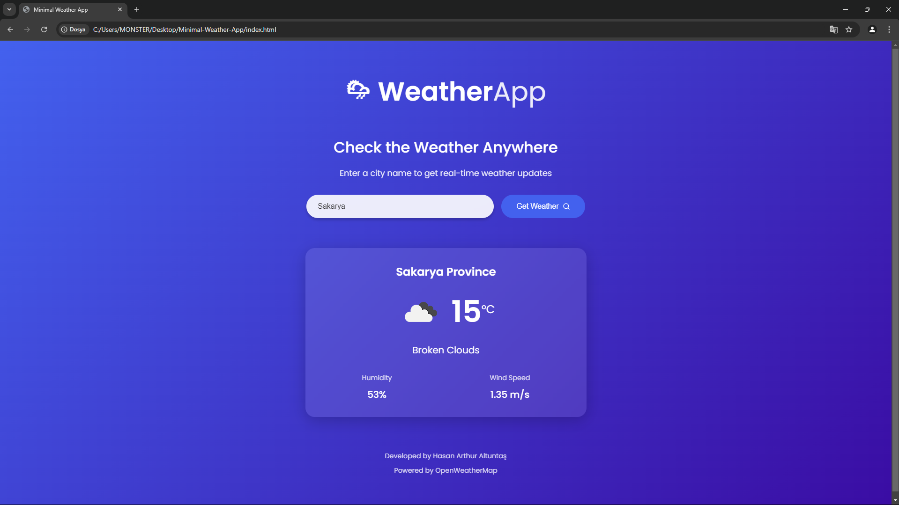

# Minimal Weather App

A modern and minimalist weather app that allows users to check the current weather in any city. The app fetches real-time data from the OpenWeatherMap API and displays the temperature, weather conditions, humidity, and wind speed for the entered city.

## Features

- 🌦 Fetch current weather data for any city.
- 🌡 Displays temperature in Celsius.
- 💨 Shows wind speed and humidity levels.
- 🌍 Easy-to-use, clean, and minimalist UI.
- 🚀 Fast and responsive interface.

## Screenshots



## Installation

1. **Clone this repository:**

   ```bash
   git clone https://github.com/HasanArthurAltuntas/weather-app.git
